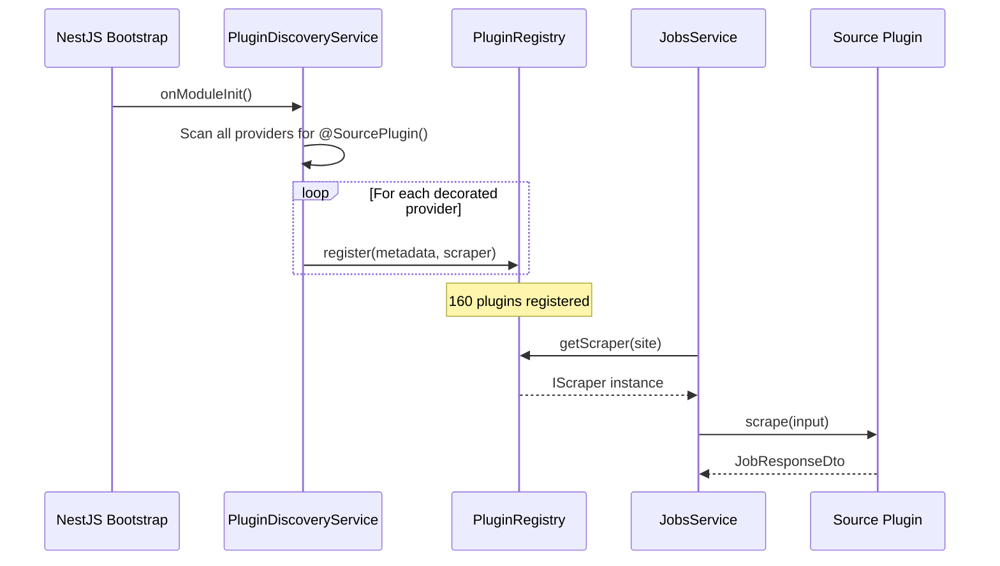

# Ever Jobs — Plugin Architecture

## Overview

Ever Jobs uses a **decorator-based plugin architecture** for its 160+ job source scrapers. Each source is self-contained in its own package under `packages/plugins/source-*` and automatically discovered at bootstrap — no hardcoded imports or wiring required.

```
packages/
├── plugin/                          # Core plugin infrastructure
│   └── src/
│       ├── decorators/              # @SourcePlugin() decorator
│       ├── discovery/               # Auto-discovery via NestJS Reflector
│       ├── interfaces/              # IPluginMetadata, PluginCategory
│       └── registry/               # PluginRegistry singleton
├── plugins/
│   ├── index.ts                     # Barrel: ALL_SOURCE_MODULES
│   ├── source-linkedin/             # Example source plugin
│   ├── source-indeed/
│   ├── source-wellfound/
│   └── ... (160 total)
```

## How It Works



### Bootstrap Flow

1. `JobsModule` imports `PluginModule` + `ALL_SOURCE_MODULES`
2. `PluginDiscoveryService.onModuleInit()` scans all NestJS providers
3. Providers decorated with `@SourcePlugin()` are detected via `Reflector`
4. Each is validated (`typeof scraper.scrape === 'function'`) and registered
5. `JobsService` injects `PluginRegistry` and dispatches searches

## Creating a New Source Plugin

### 1. Scaffold the Package

```
packages/plugins/source-mysource/
├── src/
│   ├── index.ts              # Barrel export
│   ├── mysource.module.ts    # NestJS module
│   └── mysource.service.ts   # Scraper implementation
└── package.json
```

### 2. Implement the Service

```typescript
import { Injectable, Logger } from "@nestjs/common";
import { SourcePlugin } from "@ever-jobs/plugin";
import {
  IScraper,
  ScraperInputDto,
  JobResponseDto,
  Site,
} from "@ever-jobs/models";

@SourcePlugin({
  site: Site.MYSOURCE, // Add to Site enum first
  name: "MySource",
  category: "job-board", // job-board | ats | company | niche | government | remote | regional | freelance
  // isAts: true,            // Set if requires companySlug
})
@Injectable()
export class MySourceService implements IScraper {
  private readonly logger = new Logger(MySourceService.name);

  async scrape(input: ScraperInputDto): Promise<JobResponseDto> {
    // Your scraping logic here
    return new JobResponseDto(jobs);
  }
}
```

### 3. Create the Module

```typescript
import { Module } from "@nestjs/common";
import { MySourceService } from "./mysource.service";

@Module({
  providers: [MySourceService],
  exports: [MySourceService],
})
export class MySourceModule {}
```

### 4. Register It

Add to three files:

| File                                     | What to add                                                                                   |
| ---------------------------------------- | --------------------------------------------------------------------------------------------- |
| `packages/models/src/enums/site.enum.ts` | `MYSOURCE = 'mysource'` to the `Site` enum                                                    |
| `packages/plugins/index.ts`              | Import `MySourceModule` and add to `ALL_SOURCE_MODULES`                                       |
| `tsconfig.base.json`                     | Path alias: `"@ever-jobs/source-mysource": ["packages/plugins/source-mysource/src/index.ts"]` |
| `jest.config.js`                         | `moduleNameMapper` entry matching the tsconfig path                                           |

## Key Components

### `@SourcePlugin()` Decorator

Attaches `IPluginMetadata` to a class via `SetMetadata`. Consumed by `PluginDiscoveryService` at bootstrap.

### `PluginDiscoveryService`

Runs on `OnModuleInit`. Uses NestJS `DiscoveryService` + `Reflector` to find all `@SourcePlugin()` providers and register them.

### `PluginRegistry`

Singleton `Map<Site, IScraper>` with methods:

| Method                            | Description                                |
| --------------------------------- | ------------------------------------------ |
| `getScraper(site)`                | Get scraper for a site                     |
| `has(site)`                       | Check if site is registered                |
| `getMetadata(site)`               | Get plugin metadata                        |
| `listSources()`                   | All registered plugin metadata             |
| `listSiteKeys()`                  | All registered Site enum values            |
| `listAtsSites()`                  | Sites where `isAts === true`               |
| `size`                            | Total registered count                     |
| `registerExternal(site, scraper)` | Dynamic registration for community plugins |

### Plugin Categories

| Category     | Description                                        | Examples                    |
| ------------ | -------------------------------------------------- | --------------------------- |
| `job-board`  | Major aggregators                                  | LinkedIn, Indeed, Glassdoor |
| `ats`        | Applicant Tracking Systems (require `companySlug`) | Greenhouse, Lever, Workday  |
| `company`    | Direct company career pages                        | Amazon, Apple, Google       |
| `niche`      | Specialized job boards                             | Wellfound, Dribbble, Dice   |
| `government` | Government job portals                             | USAJobs, NavJobs            |
| `remote`     | Remote-focused boards                              | RemoteOK, WeWorkRemotely    |
| `regional`   | Country/region-specific                            | StepStone, Naukri, Bayt     |
| `freelance`  | Freelance platforms                                | Upwork, Freelancer          |

## API Endpoints

### REST

```
POST /api/jobs/search     # Search across sources
POST /api/jobs/analyze    # Search + analytics
GET  /health              # Health check
GET  /metrics             # Prometheus metrics
```

### GraphQL

```graphql
query {
  searchJobs(input: { searchTerm: "engineer", siteType: [REMOTEOK] }) {
    count
    jobs {
      title
      companyName
      jobUrl
      site
    }
  }
}

query {
  listSources {
    total
    sources {
      name
      value
    }
  }
}
```

## Runtime Configuration

### `EVER_JOBS_DISABLED_SOURCES`

Comma-separated list of `Site` ids to skip at registration time. The discovery
service reads the variable in `OnModuleInit` and never registers the listed plugins,
so requests for those sites resolve to "no scraper" exactly as if the plugin were
uninstalled.

```bash
# Disable two sources for this process
export EVER_JOBS_DISABLED_SOURCES="linkedin, indeed"

# Whitespace tolerated; matching is case-insensitive
export EVER_JOBS_DISABLED_SOURCES="LinkedIn,glassdoor"

# Empty / unset → all plugins enabled (default)
unset EVER_JOBS_DISABLED_SOURCES
```

Behaviour notes:

- **Lookup parity** — `PluginRegistry.has(site)` returns `false` and
  `PluginRegistry.getScraper(site)` returns `undefined` for disabled sites.
- **Listing parity** — disabled sites do **not** appear in `listSources()`,
  `listSiteKeys()`, `listAtsSites()`, or `/api/sources`.
- **Typo guard** — unknown ids are accepted but logged at `warn` level by
  `PluginDiscoveryService` so operators notice typos without crashing the boot.
- **No restart required for read paths** — the var is consumed only at
  `OnModuleInit`. To toggle a plugin without redeploy, prefer the upcoming admin
  endpoint (Spec 001 Phase 3).

Spec reference: [`.specify/specs/001-plugin-architecture-foundation/`](../.specify/specs/001-plugin-architecture-foundation/spec.md).

